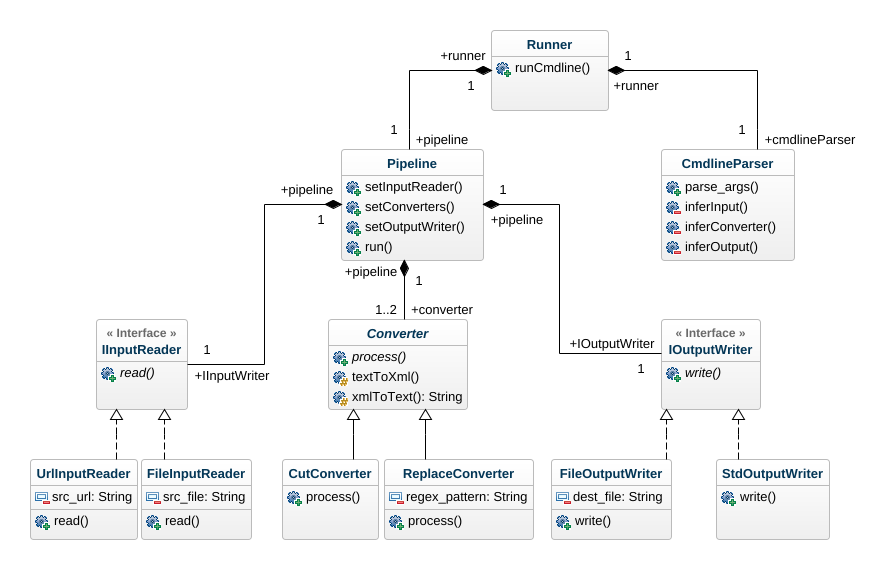

PyRssReader
===========

[](https://travis-ci.org/kragniz/cookiecutter-pypackage-minimal)

Sample RSS Reader to perform multiple text processing on xml text of a rss feed.  
Reads from a variety of inputs sources and Writes to a variety of outputs
desination are supported. PyRssReader deliberately has OOPS as design pattern to demonstrate OOPS in python.  

Usage
-----

Sample command

``` {.sourceCode .}
python PyRssReader --input http://globalissues.org/news/ --convert="cut,replace(/base/acid/)" -o tmp.txt
python PyRssReader --input http://globalissues.org/news/ --convert=cut
python PyRssReader --input articles.txt --convert="replace(/social/Social/)" -o out.txt
```

``` {.sourceCode .}
▶ python PyRssReader --help
usage: PyRssReader [-h] [--input INPUT] [--convert CONVERT] [--output OUTPUT]

optional arguments:
  -h, --help            show this help message and exit
  --input INPUT, -i INPUT
                        input url or file path
  --convert CONVERT, -c CONVERT
                        functions to apply on input
  --output OUTPUT, -o OUTPUT
                        output path
```
#### Assumptions
1. Input file articles.txt is a xml file which meets the rss specification 
2. URL points to the base url of the RSS feed. RSS feed url can be found out by appending ‘feed/‘ 
3. CUT function will be applied on the tag `<title>` and `<summary>` of the rss xml file
4. REPLACE function will be applied on the text inside the tags `<title>`, `<subtitle>`, `<author>`, `<content>`, etc inside of xml file

Installation
------------

``` {.sourceCode .}
python setup.py install
```

Implementation
--------------

-   Objects have been heavily used for separation of concerns
-   Code reusability and extensibility have been given extra importance.

Class Diagram
--------------


Authors
-------

PyRssReader was written by [Mohit Agrawal](mohitleoagrawal@gmail.com).
